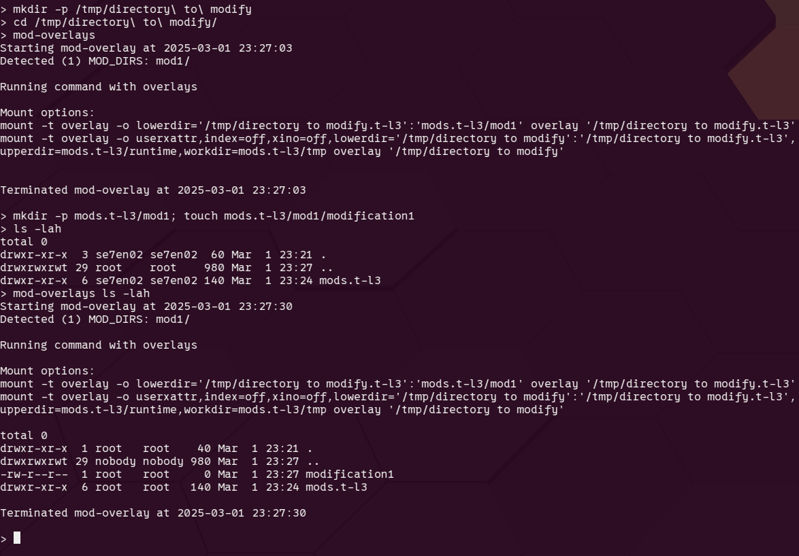
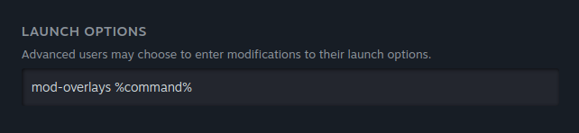

# mod-overlays

Mod overlays is a bash script that makes use of linux filesystem overlays to merge the contents of multiple mod folders into one directory, and overlays it onto a game directory to effectively install mods without altering the original game files.

A directory called `mods.t-l3` is required (created by the script on first run) which can contain any number of mod directories. Each mod directory should mirror the interanal structure of the game directory.

SYNTAX: `mod-overlays [COMMAND]`

Logs for mod-overlays are written to `mods.t-l3/mod-overlays.log`

Prefix steam games launch options with `mod-overlays` to enable overlays on that game

